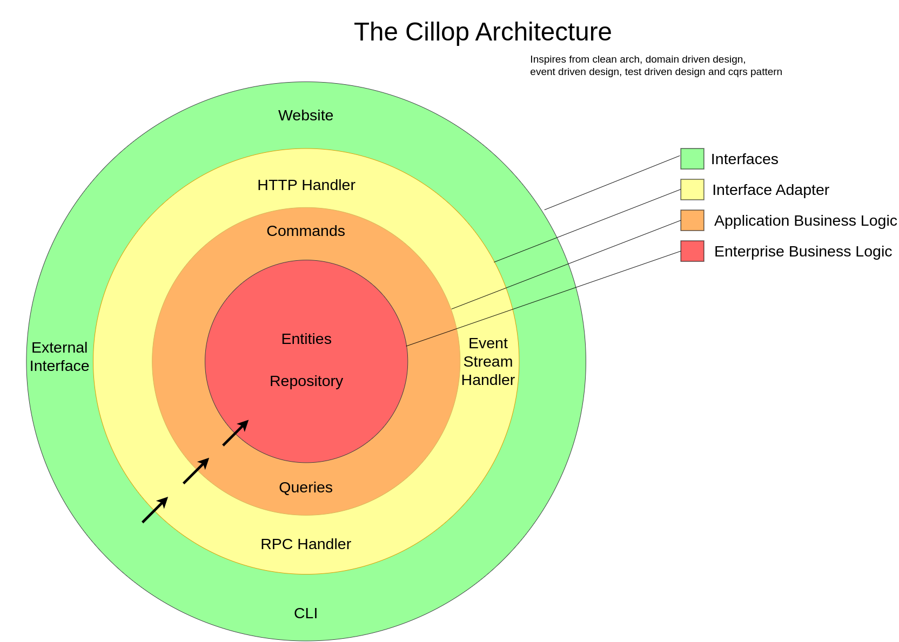

# Project Archived

Development on this project has stopped, you can still use it but you should know that there will be no future updates.

After Cillop, we created the architecture called [gopre](https://github.com/9ssi7/gopre) by further improving the approaches in Cillop and revising it according to golang and community standards. You should [check it out](https://github.com/9ssi7/gopre)!


# Cillop Architecture 🏗

Cillop is a scalable and modular application architecture designed for building robust and maintainable applications.

For detailed explanation on how things work, checkout the [ssibrahimbas's Medium Text](https://ssibrahimbas.medium.com/the-cillop-architecture-675ff2102b5a)

 

## Directory Structure 📂

### `app`

Contains core business logic components.

- `command`: Houses command handlers, which handle command requests.
  - `product_create.go`: Defines the creation of a product.
- `query`: Consists of query handlers, responsible for fetching data.
  - `product_get.go`: Defines how to get product information.

### `cmd`

- `main.go`: The entry point of the application.

### `config`

- `config.go`: Manages the application configuration files.

### `locales`

- `en.toml`: Contains localization files for supporting multiple languages.

### `pkg`

- `cqrs`: Contains components for the CQRS (Command Query Responsibility Segregation) pattern.
  - `cqrs.go`: CQRS related implementations.
- `domains`: Encapsulates business logic into separate domain models.
  - `product`: Contains all the product related business logic.
- `mongodb`: Contains everything related to MongoDB connectivity and operations.
- `server`: Houses the HTTP server configuration and initialization logic.

### `server`

Holds different types of server implementations.

- `event-stream`: Event streaming related components.
- `http`: HTTP server and related functionalities.
- `rpc`: Remote Procedure Call (RPC) server and related functionalities.
  - `protos`: Contains Protocol Buffer files.
  - `routes`: Contains generated Protocol Buffer Go files.

### `service`

- `application.go`: Contains service application logic which binds everything together.

## Building and Running 🚀

```bash
# Building the application
go build -o cillop ./cmd

# Running the application
./cillop
```

## Docker Support 🐳

A Dockerfile is included to build a Docker image of the application.

```bash
# Build Docker Image for production
docker build -t cillop-app .

# Run Docker Container for development (hot reloading)
docker build -t cillop-app -f Dockerfile.dev .

# Copy env file from .env.example
cp .env.example .env

# Run Docker Container for production
docker run -p 8080:8080 --env-file .env --name cillop-app cillop-app
```

## Nats and DB Setup 📦

### Nats

- Install Nats with jetstream locally using Docker

```bash
docker run -p 4222:4222 -p 8222:8222 -p 6222:6222 --name nats-cillop -ti nats:latest --js
```

### MongoDB

- Install MongoDB locally using Docker

```bash
docker run -d -p 27017:27017 --name mongo-cillop mongo:latest
```

## Dependencies 📦

Go Modules are used for dependency management, which are listed in go.mod and go.sum.

## Contributing 🤝

We welcome contributions! Please see CONTRIBUTING.md for details on how to contribute.

## License 📄

This project is licensed under the Apache License 2.0 - see the LICENSE file for details.
